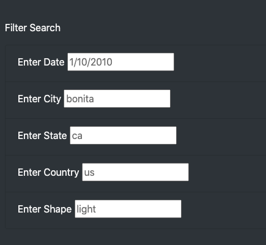

# UFOs

## Overview of Project:
The purpose of this module was to develop skills with javascript, css, and html. These skills are more practical for website/app development

## Results
Based on the UFO sighting data, there are tons of opportunities to explore for Dana or supporters of UFO sightings. The challenge though based on the data/tables we created, is that it's hard to look through all of the options. By creating the filter pane, we can allow the user the option to filter for various parameters such as Year, State, etc. For example, the filter featured below will return results located in Bonita CA on 1/10/2010 that pertain to 'light' findings.

## Summary
This website is a great beginner site that allows individuals to look through UFO sighting data. With that said, the site does have some drawback. First, the page design is very 'word/text heavy'. Most users would not spend that much time on the site to sift through all of data. Additionally, with the filters that we do have, you need to be case sensitive for things such as state and city since the data has them spelled that way. As recommendation, we could look into better quality of the data. 2nd, from a user experience, having drop downs as filters usually is easier to use than compared to exact search. Additionally, i would look to make the page more dynamic.
